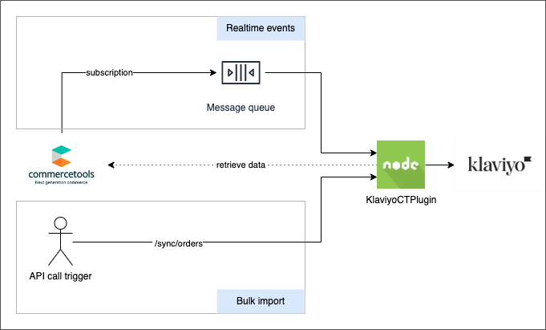

# klaviyo-ct-plugin

The [Klaviyo](https://www.klaviyo.com/) plugin for [commercetools](https://commercetools.com/) is a Node.js application
that provides the ability to sync commercetools data into Klaviyo.

<!-- START doctoc generated TOC please keep comment here to allow auto update -->
<!-- DON'T EDIT THIS SECTION, INSTEAD RE-RUN doctoc TO UPDATE -->

- [Overview](#overview)
- [Supported features](#supported-features)
- [Plugin installation](#plugin-installation)
- [How it works](#how-it-works)
- [Plugin development and customization](#plugin-development-and-customization)

<!-- END doctoc generated TOC please keep comment here to allow auto update -->

## Overview

The plugin acquires data from commercetools in two different ways:

- **Realtime data** - events are received asynchronously via
  commercetools [subscriptions](https://docs.commercetools.com/api/projects/subscriptions),
  e.g. on order creation, customer creation, etc. On receipt of these events, relevant data is fetched (if necessary)
  from commercetools and synced in to Klaviyo.
- **Bulk import** - a set of API endpoints are provided to manually trigger the data sync into Klaviyo. Typical use
  cases include the synchronization of the product catalogue or of historical customers and orders. This is typically
  performed when installing the plugin for the first time but can also be done periodically if the data becomes out of
  sync.

## Supported features

Real-time data sync:

- Customer creation
- Customer update
- Order placed
- Order fulfilled
- Order cancelled
- Order refunded (single refund)
- Category created
- Category updated
- Category deleted
- Product deleted

Bulk data import:

- Orders
- Product Catalogue and categories
- Customers

Check [data flow](docs/plugin-development-customization.md#data-flow) for all the details about the data exchanged
between commercetools and Klaviyo.

## Plugin installation

See [plugin installation documentation](docs/plugin-installation.md)

## How it works

See [how it works](docs/how-it-works.md) for the details on how the data is synced between commercetools and Klaviyo.

## Plugin development and customization

The process of setting up commercetools can differ based on the specific implementation, and the integration needs may
also vary in each scenario. Due to these variations, the plugin is distributed as an open source application to
facilitate the integration of these systems. This way, individuals are able to freely download, host, and customize the
solution according to their distinct business needs.  
See [plugin development and customization documentation](docs/plugin-development-customization.md) for all the details
on how to customize the plugin.

## Contributing

We appreciate any and all contributions to this project! Before creating an issue or raising a PR, review our
[Contributing guide](./docs/CONTRIBUTING.md). This guide reviews issue creation, prerequisites for pull requests, and
more.
