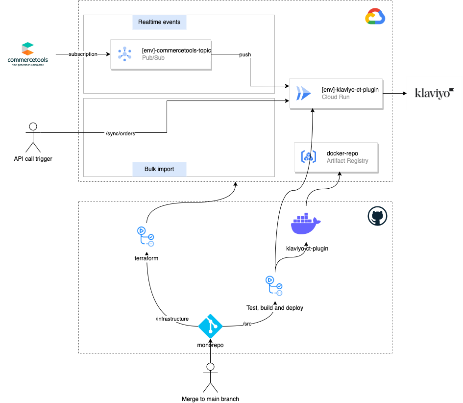

# Infrastructure
This section details how to configure a cloud environment to run the plugin, configure klaviyo, commercetools and import
tests data.  
This plugin requires [CT subscriptions](https://docs.commercetools.com/api/projects/subscriptions#destination), for this reason it can only be hosted in the following cloud providers:
* Google Cloud (GCP)
* AWS
* Azure

On premise providers can be used to host the plugin but still one of the previous cloud providers is required to receive messages from commercetools via subscriptions and forward the messages to the plugin. 

Each cloud provider provides different services and various combination are possible to host the plugin and connect commeretools subscriptions.

| Cloud Provider | Commercetools subscriptions | Plugin deployment | Other                                                                            |
|----------------|-----------------------------|-------------------|----------------------------------------------------------------------------------|
 | GCP            | pub/sub                     | Cloud Run         | <ul><li>docker repo: artifact repository</li><li>CI/CD: github actions</li></ul> |
 | GCP            | pub/sub                     | Cloud Functions   |                                                                                  |
 | AWS            | SQS                         | Lambda            |                                                                                  |
 | AWS            | EventBridge                 | Fargate           |                                                                                  |

In this section we'll use the first option in the table that uses GCP, Cloud Run and GitHub actions.




## Manual steps
The setup and configuration of a new environment for the klaviyo commercetools plugin require some manual steps:

* Commercetools project creation and API client for terraform
* Creation of the klaviyo accounts and API keys
* Google Cloud project
* Configuration of GitHub for running pipelines

The rest of the configuration of the environment (creation of the commercetools subscriptions, queues, docker
repositories...) can be done using terraform scripts.
The terraform scripts are available in `/infrastructure`

### Commercetools

The initial creation of the commercetools projects (if not already existing) and the API client for terraform must be done manually.  
The commercetools terraform scripts create the subscriptions and the API client for the plugin.
Check the section [Configuration of the pipelines in GitHub actions](#configuration-of-the-pipelines-in-gitHub-actions) on how to configure the API client and run the terraform scripts

#### Importing test data
Check the documentation
at [https://docs.commercetools.com/sdk/sunrise-data](https://docs.commercetools.com/sdk/sunrise-data)

### Klaviyo
The creation of the Klaviyo accounts needs to be done manually.
The creation of the API keys also needs to be done manually.
See [https://help.klaviyo.com/hc/en-us/articles/360002165611-Understand-multi-account-user-privileges](https://help.klaviyo.com/hc/en-us/articles/360002165611-Understand-multi-account-user-privileges)
for more info.

### Google Cloud project
In this sample implementation a single GCP project is created `klaviyo-ct-plugin` which hosts two environments separated by namespace (each
environment specific resource is prefixed with the environment name `dev` or `prod`).
The plugin is built into a docker image and deployed on [GCP Cloud Run](https://cloud.google.com/run).
Commercetools subscriptions are configured via Terraform and communicate to the plugin using a single [GCP pub/sub](https://cloud.google.com/pubsub) topic.
To create a new project if not already existing, run the bootstrap-gcp scripts to setup a new project in GCP (you need project creation rights)

```shell
cd insfrastructure/bootstrap-gcp
```

```shell
./bootstrap.sh <your-user-account>
```

The script will generate a new `terraform` service account. Create via console o CLI a service account key that will be used in GitHub.

### Configuration of the pipelines in GitHub actions
The following sections shows how to configure the CI/CD using  [GitHub Actions](https://github.com/features/actions) for CI/CD

#### GitHub configuration

* Create two [GitHub environments](https://docs.github.com/en/actions/deployment/targeting-different-environments/using-environments-for-deployment#creating-an-environment):
    * dev
    * prod
* For each commercetools project create a new API client for terraform with the following scopes:
    * manage_api_clients
    * manage_subscriptions
* Add two new secrets for each GitHub environment with the commercetools client id and secret:
    * dev environment
        * `CT_TF_CLIENT_ID`: commercetools client id
        * `CT_TF_SECRET`: commercetools secret
    * prod environment
        * `CT_TF_CLIENT_ID`: commercetools client id
        * `CT_TF_SECRET`: commercetools secret
* Create a commercetools API client for E2E tests with the following scopes:
    * manage_project
* Add two new secrets for each GitHub environment with the commercetools client id and secret:
    * dev environment
        * `CT_E2E_CLIENT_ID`: commercetools client id
        * `CT_E2E_SECRET`: commercetools secret
    * prod environment
        * `CT_E2E_CLIENT_ID`: commercetools client id
        * `CT_E2E_SECRET`: commercetools secret
* Add the following GitHub repository secrets:
    * `GCP_CREDENTIALS`: google cloud service account key (for the terraform service account created before)
* Create the klaviyo private key for each environment and add a new secret to GitHub for each environment:
    * dev environment
        * `KLAVIYO_AUTH_KEY`: the klaviyo dev project private key
    * prod environment
        * `KLAVIYO_AUTH_KEY`: the klaviyo prod project private key

* Add the following repository environment variables to GitHub:
    * `CT_API_URL`: commercetools API url
    * `CT_AUTH_URL`: commercetools AUTH url
    * `CT_SCOPE`: commercetools API client scopes
* Add the following environment specific variables to GitHub:
    * dev environment
        * `CT_PROJECT_ID`: commercetools dev project ID
        * `KLAVIYO_COMPANY_ID`: Klaviyo public api KEY
    * prod environment
        * `CT_PROJECT_ID`: commercetools prod project ID
        * `KLAVIYO_COMPANY_ID`: Klaviyo public api KEY

#### Pipelines

The following pipelines are available in `.github/workflows`

- `e2e-tests.yml`
    - Runs end-to-end tests
- `terraform.yml`
    - Setup commercetools with:
        - subscriptions
        - api clients
    - GCP setup:
        - CloudRun instance
        - Pub/Sub topic
        - Permissions
- `plugin-build-test.yml`
    - runs build, linting and tests
- `plugin-deploy`
    - Creates a docker image with the plugin source code. The docker image is tagged with the commit revision number.
    - Deploys the container to Cloud Run _dev_ and _prod_ environment
    - Runs end-to-end tests
