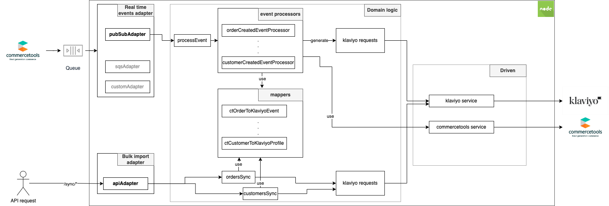

# Plugin development and customization

## Local setup

Software required:

* Node.js >= v16
* yarn

Checkout the project and from the root run the following command to install the dependencies:

```shell
yarn
```

## Tests

The project includes unit tests, integration tests and end-to-end tests.
To run unit and integration tests:

```shell
yarn test
```

### Unit tests

Unit tests are saved next to the file under test and are named `<file-to-test>.spec.ts`.
Run unit tests only:

```shell
yarn test:unit
```

### Integration tests

Integration tests are saved into `/src/test/integration`. These tests run the whole application but downstream API
calls (commercetools and klaviyo) are mocked using the mocking library [nock](https://github.com/nock/nock)
Run integration tests only:

```shell
yarn test:integration
```

When writing a new integration test API requests to downstream services (klaviyo, commercetools) can be intercepted by
adding the line `nock.recorder.rec()` at the beginning of the test.
In order to record the requests with nock it's required to call the real downstream APIs. An easy way to do so is to
duplicate the `.env.test` file in the root and call it `.env`. Then set in `.env.local` the variables `KLAVIYO_AUTH_KEY`
and `CT_API_CLIENT` with your personal API keys that can be generated
in [commercetools](https://docs.commercetools.com/merchant-center/api-clients)
and [klaviyo](https://www.klaviyo.com/account#api-keys-tab).
Finally, update the dotenv config in `jest.setup.ts` to point to the new env file:

```typescript
dotenv.config({ path: '.env' });
```

The integration tests will now run against the real downstream API and in the log will be printed the nock configuration
for each API request.
Look at any of the available integration tests for examples.

### End-to-end tests

To write and run end-to-end tests check the [documentation](e2e-tests.md)

## Plugin internals

### Data flow

#### Realtime events

Realtime events are received via commercetools subscriptions, processed and transformed into requests for the Klaviyo
APIs using a set of event processors that are saved at `src/domain/eventSync/eventProcessors`.  
The following table shows the default commercetools events handled by the plugin and how they are mapped into Klaviyo.

| commercetools event | commercetools subscription event                              | Event processor                                     | Klaviyo result                                 | Klaviyo request                                                                                                                                              |
|---------------------|---------------------------------------------------------------|-----------------------------------------------------|------------------------------------------------|--------------------------------------------------------------------------------------------------------------------------------------------------------------|
| Customer Created    | `CustomerCreated`                                             | `customer/customerCreatedEventProcessor.ts`         | Profile created                                | [Create Profile](https://developers.klaviyo.com/en/reference/create_profile) or [Profile update](https://developers.klaviyo.com/en/reference/update_profile) |
| Customer Updated    | `ResourceUpdated` > `customer`                                | `customer/customerResourceUpdatedEventProcessor.ts` | Profile updated                                | [Update Profile](https://developers.klaviyo.com/en/reference/update_profile)                                                                                 |
| Order Created       | `OrderCreated` or `OrderImported` or `OrderCustomerSet`       | `order/orderCreatedEvent.ts`                        | Order placed event and Ordered Products events | [Create Event](https://developers.klaviyo.com/en/reference/create_event)                                                                                     |
| Order State Changed | `OrderStateChanged`                                           | `order/orderStateChangedEvent.ts`                   | Order fulfilled / Order cancelled              | [Create Event](https://developers.klaviyo.com/en/reference/create_event)                                                                                     |
| Order Refunded      | `PaymentTransactionAdded` or `PaymentTransactionStateChanged` | `order/orderRefundedEvent.ts`                       | Order refunded                                 | [Create Event](https://developers.klaviyo.com/en/reference/create_event)                                                                                     |
| Category Created    | `CategoryCreated`                                             | `category/categoryCreatedEventProcessor.ts`         | Category created                               | [Create Category](https://developers.klaviyo.com/en/reference/create_catalog_category)                                                                       |
| Category Updated    | `ResourceUpdated` > `category`                                | `category/categoryResourceUpdatedEventProcessor.ts` | Category updated                               | [Update Category](https://developers.klaviyo.com/en/reference/update_catalog_category)                                                                       |
| Category Deleted    | `ResourceDeleted` > `category`                                | `category/categoryResourceDeletedEventProcessor.ts` | Category deleted                               | [Delete Category](https://developers.klaviyo.com/en/reference/delete_catalog_category)                                                                       |

#### Bulk import

| API endpoint       | Description                    | Klaviyo request                                                                                                                                                                                                                                                                                                                                                                                                                                                                                                                                                          |
|--------------------|--------------------------------|--------------------------------------------------------------------------------------------------------------------------------------------------------------------------------------------------------------------------------------------------------------------------------------------------------------------------------------------------------------------------------------------------------------------------------------------------------------------------------------------------------------------------------------------------------------------------|
| `/sync/orders`     | Sync all orders to Klaviyo     | [Create Event](https://developers.klaviyo.com/en/reference/create_event)                                                                                                                                                                                                                                                                                                                                                                                                                                                                                                 |
| `/sync/customers`  | Sync all customers to Klaviyo  | [Create Profile](https://developers.klaviyo.com/en/reference/create_profile)                                                                                                                                                                                                                                                                                                                                                                                                                                                                                             |
| `/sync/categories` | Sync all categories to Klaviyo | [Create Category](https://developers.klaviyo.com/en/reference/create_catalog_category)                                                                                                                                                                                                                                                                                                                                                                                                                                                                                   |
| `/sync/products`   | Sync all products to Klaviyo   | [Spawn Create Items Job](https://developers.klaviyo.com/en/reference/spawn_create_items_job) / [Spawn Create Variants Job](https://developers.klaviyo.com/en/reference/spawn_create_variants_job) / [Spawn Update Items Job](https://developers.klaviyo.com/en/reference/spawn_update_items_job) / [Spawn Update Variants Job](https://developers.klaviyo.com/en/reference/spawn_update_variants_job) / [Spawn Delete Variants Job](https://developers.klaviyo.com/en/reference/spawn_delete_variants_job) (with their respective "Get _action_ _objects_ Job" requests) |

### Code structure



The plugin uses the [commercetools Typescript SDK](https://docs.commercetools.com/sdk/javascript-sdk) and
the [Klaviyo Javascript SDK for Node.js](https://github.com/klaviyo/klaviyo-api-node).  
The source code is organized in the following way:

* **driving adapters (`src/infrastructure/driving`)**: are the application entry point. The application has two
  different entry points:
    * real time events: a sample pub/sub and SQS adapters are provided to sync realtime events from pub/sub or SQS
      queues to klaviyo. A new driving adapter should be provided to handle different services.
    * bulk import: an API adapter is provided to start the bulk sync of data.
* **driven adapters (`src/infrastructure/driven`)**: these are very specific to this plugin.
    * commercetools: services to interface with the commercetools APIs.
    * klaviyo: services to interface with the Klaviyo APIs.
* **domain logic  (`src/domain`)**
    * real time events
        * event processors: process a commercetools subscription message and generate a JSON request for Klaviyo using
          the mappers. Event processors can be added/changed/removed. The list of event processors to be used is passed
          to the `processEvent` method as input parameter. However, the related commercetools subscription needs to be
          configured in order to receive the expected message.
    * bulk import: to bulk import customers, products and orders
    * shared logic:
        * mappers: logic to convert a commercetools JSON object to a JSON request for Klaviyo APIs.
        * services: shared services

### Dummy services

Some functionalities are specific to the environment where the plugin is installed or different third party service can
be used. For this reason we provided only the interface of the service with a sample implementation.

| Service           | Sample implementation                         | Description                                                                                                                                                                                                                            |
|-------------------|-----------------------------------------------|----------------------------------------------------------------------------------------------------------------------------------------------------------------------------------------------------------------------------------------|
| `CurrencyService` | `src/domain/services/dummyCurrencyService.ts` | Order amounts can be available in different currencies. In order to have a meaningful representation of the data, all amounts should be converted in a single currency. This service should implement the logic to convert currencies. |

### Event processors

The `processEvent` method accepts a list of event processors. The event processors is responsible to check if the
message should be processed by the processor and to transform the commercetools message in a request for Klaviyo.

#### Available event processors

The following event processors are provided by default:

| Event processor                       | 
|---------------------------------------|
| CustomerCreatedEventProcessor         |
| CustomerResourceUpdatedEventProcessor |
| OrderCreatedEvent                     |
| OrderStateChangedEvent                |
| OrderRefundedEvent                    |
| CategoryCreatedEventProcessor         |
| CategoryResourceDeletedEventProcessor |
| CategoryResourceUpdatedEventProcessor |
| ProductResourceDeletedEventProcessor  |
| ProductUnpublishedEventProcessor      |

#### Creating a new event processors

To create a new event processor create a new class that implements the interface `AbstractEventProcessor`, then the new
processor should be added to the list of processors passed in the `processEvent` method.

### Mappers

Event processors use mappers to convert a commercetools message to a Klaviyo message. The same mappers are used for
realtime events and bulk import, this allows to have a consistent behaviour when data is passed to klaviyo.  
Mappers can be found in `src/domain/shared/mappers`

### Adapt plugin to different message queues

The plugin supports out of the box GCP Pub/Sub, to use a different message queue (AWS Eventbridge, AWS SNS, Azure
Service Bus...) the plugin needs some code change.  
The existing GCP Pub/Sub queue adapter can be found in `src/infrastructure/driving/adapter/eventSync/pubsubAdapter.ts`,
it is also provided an example for AWS SQS `src/infrastructure/driving/adapter/eventSync/sqsAdapter.ts`.
Check your selected message queue documentation to learn how the message should be consumed (e.g. push/pull) and the
format of the payload received.
Once the code to get the message from the queue is ready call the `processEvent` method with the message payload,
optionally the method accepts the list of eventProcessors that can be overridden to remove or add new event processors.

### Error handling

#### Realtime events

The commercetools events are sent on the configured queue and consumed by the plugin.  
The event is filtered, transformed and sent to klaviyo using the `processEvent` method.   
The following outcomes are possible:

1. Message sent correctly: klaviyo has accepted the request, and the `processEvent` method returns `status: "OK"`. In
   this
   case the messages should be acknowledged and removed from the queue.
2. Message invalid: klaviyo returned a `4xx` error, the request is invalid or unauthenticated. The `processEvent` method
   logs
   the error and returns `status: "4xx"`, this value can be used to build the custom logic to handle the error, for
   example, to create
   alerts, send a message to a DLQ...
3. Exception: klaviyo returned a `5xx` error, this might be caused by a temporary glitch with the klaviyo API server and
   typically the request should be retried.
   The `processEvent` method throws an error. The `processEvent` caller should catch the error and not acknowledge the
   message to the queue, so that the message can be reprocessed later.

#### Bulk import

The bulk import is typically a long-running process for this reason the request to sync data is running in background
and no errors are returned via the API response.
To check the import errors it's required to check the execution logs where it's possible to see the details of any error
and the stats.
Example:

```shell
...
{"level":"info","message":"Historical orders import. Total orders to be imported 497, total klaviyo events: 1510, successfully imported: 218, errored: 1292, elapsed time: 40 seconds"}
...
```

### Security

#### Secrets

The klaviyo API key is passed via an environment variable. When deployed on the cloud, use your cloud specific secrets
manager to store and retrieve the key.

#### API endpoints

The bulk import of data into Klaviyo can be triggered via API calls. The API endpoints should be protected via
authentication or only accessible in a private network.

### Dependencies

Some of the dependencies in `package.json` are specific to GCP, when using a different cloud provider those dependencies
can be removed to reduce the bundle size, this will improve the start-up time when used in serverless environments.
