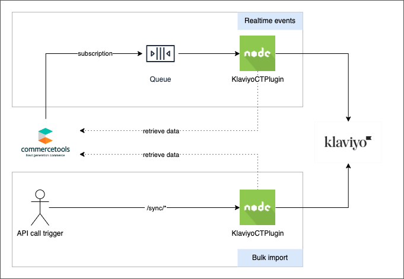

# Plugin installation

The plugin is a Node.js application and can be deployed in different ways and configurations.

## Deployment options

The plugin handles both realtime events and bulk data import. It can be configured to handle only realtime
events or bulk data import.

### Two deployments

**Recommended**  
This is the recommended way to deploy the plugin. The same plugin is deployed as two separate services. One service
handles the realtime events from commercetools
subscription, the other service handles the data bulk import.

* Realtime events: this deployment unit can scale horizontally to handle events coming via commercetools
  subscriptions.  
  Follow [How to run the real time events module](./how_to_run_realtime.md)
* Bulk imports: this deployment should not scale horizontally and have a single running instance, this configuration
  allows to call the APIs to force the stop of imports in progress.  
  Follow [How to run the bulk import module](./how_to_run_bulk_import.md)

### Single deployment

This option is not recommended, it has the following downsides compared to two deployments:

* If the single deployment is configured to scale horizontally then it might not be possible to stop a running bulk
  import.
* If the single deployment is configured to not scale horizontally (single instance) then it will be possible to stop a
  running
  bulk import but the realtime events processing might be slower when the load of events is high.

To install the plugin in this configuration follow the instruction of the two deployment configuration but a single
commercetools API client should be created with both the scopes required by the real-time module and the bulk import
module. The environment variable `APP_TYPE` should NOT be set.

## Configuration

The plugin has a default configuration that can optionally be customized.  
The configuration is saved in the `/config` directory and can be different per environment (the env variable `NODE_ENV`
is used to select the environment).  
The plugin uses the NPM package https://www.npmjs.com/package/config to load the configuration, this package allows to
override the configuration in several ways
including [environment variables](https://github.com/node-config/node-config/wiki/Environment-Variables), check
the `config` package documentation for more information.  
In the following table are listed all the available properties

| Property                                 | Type         | Default                                                                    | Description                                                                                                                                                                                                                                                               |
|------------------------------------------|--------------|----------------------------------------------------------------------------|---------------------------------------------------------------------------------------------------------------------------------------------------------------------------------------------------------------------------------------------------------------------------|
| order.states.changed.cancelledOrder      | String Array | [`Cancelled`]                                                              | The list of commercetools `order.orderState` value/s that trigger a [Cancelled Order](https://developers.klaviyo.com/en/docs/guide_to_integrating_a_platform_without_a_pre_built_klaviyo_integration#fulfilled-order-cancelled-order-and-refunded-order) event in klaviyo |
| order.states.changed.fulfilledOrder      | String Array | [`Confirmed`, `Complete`]                                                  | The list of commercetools `order.orderState` value/s that trigger a [Fulfilled Order](https://developers.klaviyo.com/en/docs/guide_to_integrating_a_platform_without_a_pre_built_klaviyo_integration#fulfilled-order-cancelled-order-and-refunded-order) event in klaviyo |
| order.states.created.placedOrder         | String Array | [`Open`]                                                                   | The list of commercetools `order.orderState` value/s that trigger a [Fulfilled Order](https://developers.klaviyo.com/en/docs/guide_to_integrating_a_platform_without_a_pre_built_klaviyo_integration#fulfilled-order-cancelled-order-and-refunded-order) event in klaviyo |
| order.states.created.placedOrder         | String Array | [`Open`]                                                                   | The list of commercetools `order.orderState` value/s that trigger a [Fulfilled Order](https://developers.klaviyo.com/en/docs/guide_to_integrating_a_platform_without_a_pre_built_klaviyo_integration#fulfilled-order-cancelled-order-and-refunded-order) event in klaviyo |
| order.messages.changed                   | String Array | [`OrderStateChanged`]                                                      | TODO                                                                                                                                                                                                                                                                      |
| order.messages.created                   | String Array | [`OrderStateChanged`]                                                      |                                                                                                                                                                                                                                                                           |
| order.properties.include                 | String Array | [`OrderStateChanged`]                                                      |                                                                                                                                                                                                                                                                           |
| order.properties.exclude                 | String Array | [`OrderStateChanged`]                                                      |                                                                                                                                                                                                                                                                           |
| order.properties.map                     | Object       | {}                                                                         |                                                                                                                                                                                                                                                                           |
| order.metrics.cancelledOrder             | String       | `Cancelled Order`                                                          |                                                                                                                                                                                                                                                                           |
| order.metrics.fulfilledOrder             | String       | `Fulfilled Order`                                                          |                                                                                                                                                                                                                                                                           |
| order.metrics.placedOrder                | String       | `Placed Order`                                                             |                                                                                                                                                                                                                                                                           |
| order.metrics.orderedProduct             | String       | `Ordered Product`                                                          |                                                                                                                                                                                                                                                                           |
| order.metrics.refundedOrder              | String       | `Refunded Order`                                                           |                                                                                                                                                                                                                                                                           |
| order.customFields.properties.include    | String Array | []                                                                         |                                                                                                                                                                                                                                                                           |
| order.customFields.properties.exclude    | String Array | []                                                                         |                                                                                                                                                                                                                                                                           |
| order.customFields.properties.map        | Object       | {}                                                                         |                                                                                                                                                                                                                                                                           |
| customer.messages.addressChanged         | String Array | [`CustomerAddressAdded`,`CustomerAddressRemoved`,`CustomerAddressChanged`] |                                                                                                                                                                                                                                                                           |
| customer.customFields.properties.include | String Array | []                                                                         |                                                                                                                                                                                                                                                                           |
| customer.customFields.properties.exclude | String Array | []                                                                         |                                                                                                                                                                                                                                                                           |
| customer.customFields.properties.map     | Object       | {}                                                                         |                                                                                                                                                                                                                                                                           |
| payment.messages.transactionAdded        | String Array | [`PaymentTransactionAdded`]                                                |                                                                                                                                                                                                                                                                           |
| payment.messages.transactionChanged      | String Array | [`PaymentTransactionStateChanged`]                                         |                                                                                                                                                                                                                                                                           |
| payment.states.validTransactionStates    | String Array | [`Initial`, `Pending`, `Success`]                                          |                                                                                                                                                                                                                                                                           |
| category.messages.created                | String Array | [`CategoryCreated`]                                                        |                                                                                                                                                                                                                                                                           |
| product.messages.deleted                 | String Array | [`ProductUnpublished`]                                                     |                                                                                                                                                                                                                                                                           |

## Plugin update

Check the [changelog](changelog.md) page for the list of changes.
If the source code was previously customised reapply the custom changes to the new version of the plugin.

todo write internal doc on release creation and changelog generation.
See https://docs.github.com/en/repositories/releasing-projects-on-github/automatically-generated-release-notes

## Sample installation on GCP

In the [Step-By-Step](step-by-step-gcp.md) section we show how to install and configure the plugin in a sample
configuration that uses Google Cloud Platform as cloud provider and GitHub actions to host and develop a fork of the
plugin for customisations and for deploy the plugin to test and production environments.
