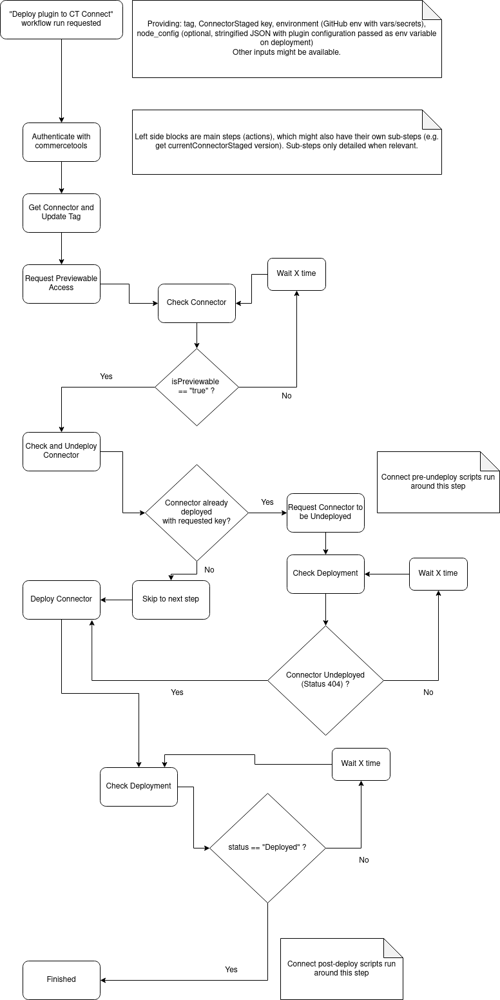

# How to deploy the plugin on commercetools Connect

This section details how to search for and deploy the plugin as a connector on commercetools connect, configure Klaviyo,
commercetools and import
test data.

Connect is a new way for developers to make e-commerce integrations available to clients and for clients to quickly
deploy those integrations into their projects. For more details check
the [commercetools Connect documentation](https://docs.commercetools.com/connect).

Only the real-time sync component of this plugin is supported under Connect.

## Manual steps

The setup and configuration of a new environment for the Klaviyo commercetools plugin require some manual steps:

* commercetools project creation and API client
* Creation of the Klaviyo accounts and API keys

### commercetools

The initial creation of the commercetools projects (if not already existing) and the API client for terraform must be
done manually.  
Subscriptions needed to receive messages are handled automatically by the deployment but can be tweaked manually after.
They can also be created manually if needed.

#### Importing test data

Check the documentation
at [https://docs.commercetools.com/sdk/sunrise-data](https://docs.commercetools.com/sdk/sunrise-data)

### Klaviyo

The creation of the Klaviyo accounts needs to be done manually.
The creation of the API keys also needs to be done manually.
See [https://help.klaviyo.com/hc/en-us/articles/360002165611-Understand-multi-account-user-privileges](https://help.klaviyo.com/hc/en-us/articles/360002165611-Understand-multi-account-user-privileges)
for more info.

## How does the plugin work with commercetools Connect?

Under the hood, Connect uses some well-known technologies to host integrations for projects, like GCP CloudRun and
Pub/Sub. Therefore, the end result is very similar to hosting the plugin on GCP yourself, but without having to manage
the underlying infrastructure. Since you don't have access to said infrastructure, all management of Connectors and
Deployments are handled through the commercetools API.

There are a few ways in which you would use this plugin with Connect:

* [Deploying the default plugin with default configurations](#deploying-the-default-plugin-with-default-configurations)
* [Deploying the default plugin with custom configurations](#deploying-the-default-plugin-with-custom-configurations)
* [Deploying a forked plugin with code changes](#deploying-a-forked-plugin-with-code-changes)

The process for this is already detailed at
the [Getting started](https://docs.commercetools.com/connect/getting-started#deploy-a-connector) Connect documentation
page, but we'll summarize it for each scenario.

### Deploying the default plugin with default configurations

This scenario applies to clients who want all Klaviyo functionality and have simple commercetools projects, as in single
store, single channel configurations with little or no custom types. It also serves as a way to try the plugin and
determine if you need configuration changes or make a fork.

- [Authenticate](https://docs.commercetools.com/api/authorization#client-credentials-flow) with commercetools to get a
  token.
- [Search](https://docs.commercetools.com/connect/getting-started#search-for-a-connector) for the Connector. Take note
  of the Connector `id` or `key`, the `version` property and the variables in the `configurations` property.
- [Create a Deployment](https://docs.commercetools.com/connect/getting-started#create-a-deployment) with the right data.
    - Here's an example deployment for this plugin:
    - ```json
        {
		  "key" : "your-deployment-key",
		  "connector" : {
		    "key" : "<connector key from search>", // Could also be "id": "<connector id from search>"
		    "version" : 42, // version from search
		  },
		  "region" : "us-central1.gcp", // a region matching your project is recommended, must be gcp
		  "configurations" : [ {
		    "applicationName" : "plugin",
		    "standardConfiguration" : [ 
		        {
		            "key" : "CT_API_URL",
		            "value" : "<your commercetools API url>"
		        },
		        {
		            "key" : "CT_AUTH_URL",
		            "value" : "<your commercetools auth url>"
		        },
		        {
		            "key" : "CT_PROJECT_ID",
		            "value" : "<your commercetools project id>"
		        },
		        {
		            "key" : "CT_SCOPES",
		            "value" : "<your commercetools client scope>" // optional, recommended
		        },
		        {
		            "key" : "PRODUCT_URL_TEMPLATE",
		            "value" : "https://example-store.com/products/{{productSlug}}" // optional, used for Klaviyo product URLs
		        },
		        {
		            "key" : "PREFERRED_LOCALE",
		            "value" : "en-US" // optional
		        },{
                "key" : "CONNECT_ENV",
                "value" : "<an arbitrary env string, used for subscription keys>" // also checked to apply Connect specific properties
            }
		    ],
		    "securedConfiguration" : [ // Values in this property are hidden after the request is made
		        {
		            "key" : "CT_API_CLIENT",
		            "value" : "{\"clientId\":\"<your client id>\", \"secret\":\"<your client secret>\"}"
		        },
		        {
		            "key" : "KLAVIYO_AUTH_KEY",
		            "value" : "<your klaviyo private auth key>"
		        }
		    ]
		  } ]
		}
      ```
- [Monitor the deployment progress](https://docs.commercetools.com/connect/getting-started#monitor-the-deployment-progress)
  and wait for it to be completed.
- Once completed, [post-deploy scripts](https://docs.commercetools.com/connect/convert-existing-integration#postdeploy)
  will automatically generate subscriptions for all needed messages. At this point, the plugin is ready and waiting for
  messages.

### Deploying the default plugin with custom configurations

As a client, you may need to tweak some settings for the plugin to send the right information. The process to apply
custom configurations is essentially the same as the one with the default configuration. Since it's not possible to
change the
files for a Connector without forking it, it's not possible to tweak the `plugin/config/default.json` file directly to
make configuration changes. However, we support providing an additional variable in `standardConfiguration` to override
this configuration.

- [Authenticate](https://docs.commercetools.com/api/authorization#client-credentials-flow) with commercetools to get a
  token.
- [Search](https://docs.commercetools.com/connect/getting-started#search-for-a-connector) for the Connector. Take note
  of the Connector `id` or `key`, the `version` property and the variables in the `configurations` property.
- [Create a Deployment](https://docs.commercetools.com/connect/getting-started#create-a-deployment) with the right data.
    - This time, we'll be adding another entry to `standardConfiguration`. This object will have `"key": "NODE_CONFIG"`
      and `"value"` will be a string, which contains a "stringified" version of `plugin/config/default.json` with the
      changes you need.
    - Here's an example deployment for this scenario:
    - ```json
        {
		  "key" : "your-deployment-key",
		  "connector" : {
		    "key" : "<connector key from search>", // Could also be "id": "<connector id from search>"
		    "version" : 42, // version from search
		  },
		  "region" : "us-central1.gcp", // a region matching your project is recommended, must be gcp
		  "configurations" : [ {
		    "applicationName" : "plugin",
		    "standardConfiguration" : [ 
		        {
		            "key" : "CT_API_URL",
		            "value" : "<your commercetools API url>"
		        },
		        {
		            "key" : "CT_AUTH_URL",
		            "value" : "<your commercetools auth url>"
		        },
		        {
		            "key" : "CT_PROJECT_ID",
		            "value" : "<your commercetools project id>"
		        },
		        {
		            "key" : "CT_SCOPES",
		            "value" : "<your commercetools client scope>" // optional, recommended
		        },
		        {
		            "key" : "PRODUCT_URL_TEMPLATE",
		            "value" : "https://example-store.com/products/{{productSlug}}" // optional, used for Klaviyo product URLs
		        },
		        {
		            "key" : "PREFERRED_LOCALE",
		            "value" : "en-US" // optional
		        },{
                "key" : "CONNECT_ENV",
                "value" : "<an arbitrary env string, used for subscription keys>" // also checked to apply Connect specific properties
            },{
			        	"key": "NODE_CONFIG",
			        	"value": "{\"customer\":\"{\"customFields\":{\"properties\":{ ... }}}\"}" // stringified and escaped JSON configuration
		        }
		    ],
		    "securedConfiguration" : [ // Values in this property are hidden after the request is made
		        {
		            "key" : "CT_API_CLIENT",
		            "value" : "{\"clientId\":\"<your client id>\", \"secret\":\"<your client secret>\"}"
		        },
		        {
		            "key" : "KLAVIYO_AUTH_KEY",
		            "value" : "<your klaviyo private auth key>"
		        }
		    ]
		  } ]
		}
      ```
- After this, all other steps remain the same.

Providing a custom configuration like this may not be the best solution, but it's the only straightforward way due to
Connect limitations. Large bodies are allowed, so sending a decently sized configuration should not be an issue.

### Deploying a forked plugin with code changes

If you need to make several code changes, want to provide the default configuration as a file or simply wish to roll
your own version of the plugin for any reason, but you don't want to give up on the convenience of Connect, you can
always fork the code and create/deploy your own Connector.

The official Connector is both public and certified by commercetools, but forks don't need to fulfil this requirement.
All Connectors are private by default, can be deployed in staging or "Previewable" mode, and support restricting
deployment by region and project. By not doing certification, you'll essentially be creating/deploying what
commercetools calls a "ConnectorStaged", which can be used indefinitely.

> **_NOTE:_** If your forked repository is private, in order for commercetools to have access to it you must give
> read access to the Connect Machine User (`connect-mu` on GitHub).
> See [documentation](https://docs.commercetools.com/connect/development#upload-and-create-a-release-on-github).

The steps for this are similar to a default deployment, with the exception that we'll be creating our ConnectorStaged
first. The process
and all objects are covered in
the [Create a Connector](https://docs.commercetools.com/connect/getting-started#create-a-connector) section of the
Connect documentation.

- [Authenticate](https://docs.commercetools.com/api/authorization#client-credentials-flow) with commercetools to get a
  token.
- Rather than searching, [Create a Connector](https://docs.commercetools.com/connect/getting-started#create-a-connector)
  with the appropriate ConnectorDraft, based on the contents of this repository's `connect.yaml` (which, if you've
  forked the repository, you could also tweak).
    - Here's an example of what a ConnectorDraft for this plugin would look like:
    - ```json
        {
		  "key" : "<your connector key>",
		  "name" : "Klaviyo commercetools plugin",
		  "description" : "<any description you wish to provide>",
		  "creator" : {
		    "title" : "Mr",
		    "name" : "John Doe",
		    "email" : "example@company.com",
		    "company" : "Example Company",
		    "noOfDevelopers" : 999
		  },
		  "repository" : {
		    "url" : "git@github.com:owner/repo.git", // HTTPS or SSH access, dependds on repo visibility
		    "tag" : "vX.Y.Z" // Branches technically work, not recommended
		  },
		  "supportedRegions" : [ "us-central1.gcp"]
		}
      ```
    - Once the ConnectorStaged is created, make a request
      to [request Previewable access](https://docs.commercetools.com/connect/getting-started#request-previewable-status-for-connectorstaged)
      for your Connector.
    - Wait for the `isPreviewable` property to change into `"true"`, this will take several minutes. Progress and/or
      results might be available under the `previewableReport` property during/after Previewable status is
      granted/rejected.
    - After your Connector is previewable, follow the rest of the deployment steps with the `id`/`key`, `version`
      and `configurations` from your forked Connector. Also, the `connector` object MUST have a `"staged": true`
      property, otherwise it won't be able to find your ConnectorStaged.

With this, you should be ready to use your own version of the plugin under Connect. Keep in mind any time you push a new
tag and [set this new tag](https://docs.commercetools.com/connect/connectors-staged#set-repository) for your
ConnectorStaged, you must request Previewable access again.

## Deploying forked plugins to Connect using Github Actions

A GitHub Workflow with several actions is provided for development/testing purposes. With some tweaks, and after adding
the needed variables and secrets (see `.github/workflows/deploy-connect.yml`), it will allow you to keep your
ConnectorStaged up to date and deploy new versions to Connect.

The workflow assumes you have an existing ConnectorStaged, but may not allow you to set all environment variables you
need, or have the defaults you expect on deployment. Always double-check the workflow and its actions before using it.

Below is a diagram that roughly shows the actions performed by this workflow.


