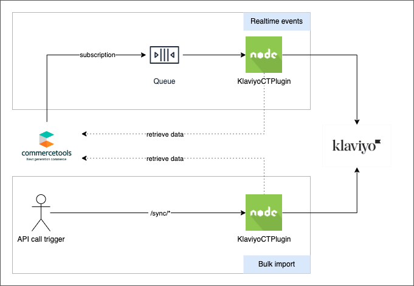
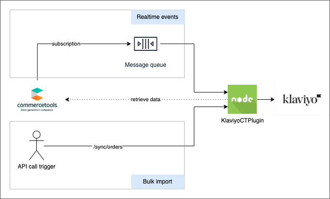

# Plugin installation

The plugin is a Node.js application and can be deployed in different ways and configurations.

## Deployment strategies

The plugin handles both realtime events and bulk data import. It can also be configured to handle only realtime
events or only bulk data import.

### Two deployments

**Recommended**  
This is the recommended way to deploy the plugin. The same plugin is deployed as two separate services. One service
handles the realtime events from commercetools
subscription, the other service handles the data bulk import.

* Realtime events: this deployment unit can scale horizontally to handle events coming via commercetools
  subscriptions.  
  Follow [How to run the real time events module](./how_to_run_realtime.md)
* Bulk imports: this deployment should not scale horizontally and have a single running instance, this configuration
  allows to call the APIs to force the stop of imports in progress.  
  Follow [How to run the bulk import module](./how_to_run_bulk_import.md)

### Single deployment

This option is not recommended, it has the following downsides compared to two deployments:

* If the single deployment is configured to scale horizontally then it might not be possible to stop a running bulk
  import.
* If the single deployment is configured to not scale horizontally (single instance) then it will be possible to stop a
  running
  bulk import but the realtime events processing might be slower when the load of events is high.

To install the plugin in this configuration follow the instruction of the two deployment configuration but a single
commercetools API client should be created with both the scopes required by the real-time module and the bulk import
module. The environment variable `APP_TYPE` should NOT be set.

## Deployment options

The plugin can be deployed to any platform/environment where you can run Node.js applications. A basic
Dockerfile is included, so it can also be deployed as a container to many providers. This documentation includes two
example of how the plugin can be deployed on:

- [Google Cloud Platform with CloudRun](#sample-installation-on-google-cloud-platform-gcp)
- [commercetools Connect](#deploying-on-commercetools-connect)

### Sample installation on Google Cloud Platform (GCP)

In the [Step-By-Step](step-by-step-gcp.md) section we show how to install and configure the plugin in a sample
configuration that uses Google Cloud Platform as cloud provider and GitHub actions to host and develop a fork of the
plugin for customisations and for deploying the plugin to test and production environments.

### Deploying on commercetools Connect

In the [How to deploy using Connect](how-to-deploy-ct-connect.md) section we show how to search for and deploy the
plugin with common use cases, either with the original source code from this repository or by forking and rolling your
own connector with custom code changes.

## Configuration

The plugin has a default configuration that can optionally be customized.  
The configuration is saved in the `/config` directory and can be different per environment (the env variable `NODE_ENV`
is used to select the environment).  
The plugin uses the NPM package https://www.npmjs.com/package/config to load the configuration, this package allows to
override the configuration in several ways
including [environment variables](https://github.com/node-config/node-config/wiki/Environment-Variables), check
the `config` package documentation for more information.  
In the following table are listed all the available properties

| Property                                 | Type         | Default                                                                    | Description                                                                                                                                                                                                                                                               |
|------------------------------------------|--------------|----------------------------------------------------------------------------|---------------------------------------------------------------------------------------------------------------------------------------------------------------------------------------------------------------------------------------------------------------------------|
| order.states.changed.cancelledOrder      | String Array | [`Cancelled`]                                                              | The list of commercetools `order.orderState` value/s that trigger a [Cancelled Order](https://developers.klaviyo.com/en/docs/guide_to_integrating_a_platform_without_a_pre_built_klaviyo_integration#fulfilled-order-cancelled-order-and-refunded-order) event in klaviyo |
| order.states.changed.fulfilledOrder      | String Array | [`Confirmed`, `Complete`]                                                  | The list of commercetools `order.orderState` value/s that trigger a [Fulfilled Order](https://developers.klaviyo.com/en/docs/guide_to_integrating_a_platform_without_a_pre_built_klaviyo_integration#fulfilled-order-cancelled-order-and-refunded-order) event in klaviyo |
| order.states.created.placedOrder         | String Array | [`Open`]                                                                   | The list of commercetools `order.orderState` value/s that trigger a [Fulfilled Order](https://developers.klaviyo.com/en/docs/guide_to_integrating_a_platform_without_a_pre_built_klaviyo_integration#fulfilled-order-cancelled-order-and-refunded-order) event in klaviyo |
| order.messages.changed                   | String Array | [`OrderStateChanged`]                                                      | The list of commercetools messages that trigger [Fulfilled Order or Cancelled Order](https://developers.klaviyo.com/en/docs/guide_to_integrating_a_platform_without_a_pre_built_klaviyo_integration#fulfilled-order-cancelled-order-and-refunded-order) events in klaviyo |
| order.messages.created                   | String Array | [`OrderCreated`]                                                           | The list of commercetools order messages that trigger a [Placed Order](https://developers.klaviyo.com/en/docs/guide_to_integrating_a_platform_without_a_pre_built_klaviyo_integration#placed-order) event in klaviyo                                                      |
| order.properties.include                 | String Array | []                                                                         | The list of properties from a commercetools order to be explicitly included in Klaviyo order events                                                                                                                                                                       |
| order.properties.exclude                 | String Array | []                                                                         | The list of properties from a commercetools order to be explicitly excluded in Klaviyo order events                                                                                                                                                                       |
| order.properties.map                     | Object       | {}                                                                         | An object that defines how a commercetools order property (key) is mapped/renamed for Klaviyo order events (value). E. g.: `"lineItems":"items"`.                                                                                                                         |
| order.metrics.cancelledOrder             | String       | `Cancelled Order`                                                          | The metric name to be used when sending order cancelled events to Klaviyo                                                                                                                                                                                                 |
| order.metrics.fulfilledOrder             | String       | `Fulfilled Order`                                                          | The metric name to be used when sending order fulfilled events to Klaviyo                                                                                                                                                                                                 |
| order.metrics.placedOrder                | String       | `Placed Order`                                                             | The metric name to be used when sending order placed events to Klaviyo                                                                                                                                                                                                    |
| order.metrics.orderedProduct             | String       | `Ordered Product`                                                          | The metric name to be used when sending ordered product events to Klaviyo                                                                                                                                                                                                 |
| order.metrics.refundedOrder              | String       | `Refunded Order`                                                           | The metric name to be used when sending order refunded events to Klaviyo                                                                                                                                                                                                  |
| order.customFields.properties.include    | String Array | []                                                                         | The list of custom fields from a commercetools order to be explicitly included in Klaviyo order events                                                                                                                                                                    |
| order.customFields.properties.exclude    | String Array | []                                                                         | The list of custom fields from a commercetools order to be explicitly excluded in Klaviyo order events                                                                                                                                                                    |
| order.customFields.properties.map        | Object       | {}                                                                         | An object that defines how commercetools order custom fields (key) is mapped/renamed for Klaviyo order events (value). E. g.: `"isInternational":"international"`.                                                                                                        |
| customer.messages.addressChanged         | String Array | [`CustomerAddressAdded`,`CustomerAddressRemoved`,`CustomerAddressChanged`] | The list of commercetools messages that trigger a [Update Profile](https://developers.klaviyo.com/en/reference/update_profile) request in klaviyo                                                                                                                         |
| customer.customFields.properties.include | String Array | []                                                                         | The list of custom fields from a commercetools customer to be explicitly included in Klaviyo profile requests                                                                                                                                                             |
| customer.customFields.properties.exclude | String Array | []                                                                         | The list of custom fields from a commercetools customer to be explicitly excluded in Klaviyo profile requests                                                                                                                                                             |
| customer.customFields.properties.map     | Object       | {}                                                                         | An object that defines how a commercetools customer custom fields (key) is mapped/renamed for Klaviyo profile requests (value). E. g.: `"isInternational":"international"`.                                                                                               |
| payment.messages.transactionAdded        | String Array | [`PaymentTransactionAdded`]                                                | The list of commercetools payment messages that trigger a [Refunded Order](https://developers.klaviyo.com/en/docs/guide_to_integrating_a_platform_without_a_pre_built_klaviyo_integration#fulfilled-order-cancelled-order-and-refunded-order) event in klaviyo            |
| payment.messages.transactionChanged      | String Array | [`PaymentTransactionStateChanged`]                                         | The list of commercetools payment messages that trigger a [Refunded Order](https://developers.klaviyo.com/en/docs/guide_to_integrating_a_platform_without_a_pre_built_klaviyo_integration#fulfilled-order-cancelled-order-and-refunded-order) event in klaviyo            |
| payment.states.validTransactionStates    | String Array | [`Initial`, `Pending`, `Success`]                                          | The list of commercetools payment transaction states that trigger a [Refunded Order](https://developers.klaviyo.com/en/docs/guide_to_integrating_a_platform_without_a_pre_built_klaviyo_integration#fulfilled-order-cancelled-order-and-refunded-order) event in klaviyo  |
| category.messages.created                | String Array | [`CategoryCreated`]                                                        | The list of commercetools messages that trigger a [Create Category](https://developers.klaviyo.com/en/reference/create_catalog_category) request in klaviyo                                                                                                               |
| product.messages.published               | String Array | [`ProductPublished`]                                                       | The list of commercetools messages that trigger a [Create Item](https://developers.klaviyo.com/en/reference/create_catalog_item) or  [Update Item](https://developers.klaviyo.com/en/reference/update_catalog_item) request in klaviyo                                    |
| product.inventory.useChannelInventory    | String       | [`''`]                                                                     | Channel (uuid) to use when sending inventory quantities to Klaviyo                                                                                                                                                                                                        |

## Plugin update

Check the [changelog](changelog.md) page for the list of changes.
If the source code was previously customised reapply the custom changes to the new version of the plugin.
